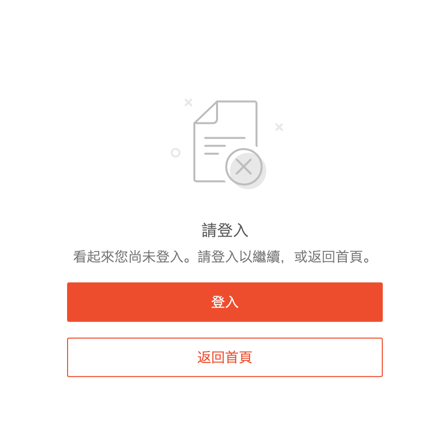
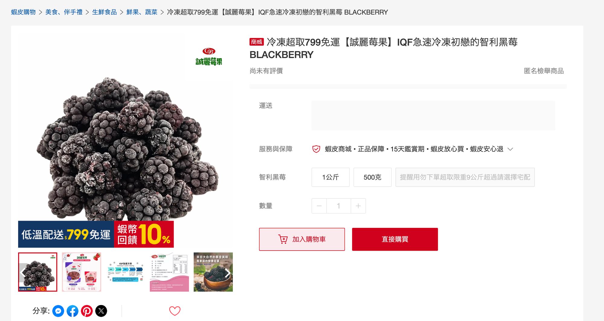

# Shopee Peek

某新加坡電商會對未登入的訪客跳出登入頁，阻擋瀏覽商品。作者基於資訊自由流通的精神開發這支油猴腳本：從 Google 搜尋結果點進商品頁，不用登入就能看到商品資訊。

## 安裝

1. 安裝 [Tampermonkey](https://www.tampermonkey.net/)
2. Chromium 系瀏覽器（Chrome、Brave、Edge）：到 `chrome://extensions` → Tampermonkey → 詳細資料 → 打開「允許使用者腳本」
3. 點這個連結安裝：[shopee-peek.user.js](https://raw.githubusercontent.com/YTsnipers/shopee-peek/main/shopee-peek.user.js)

## 截圖

未安裝：未登入時被導到錯誤頁

安裝後：直接顯示原生商品頁

## 能做和不能做

| 能看到 | 看不到 |
|---|---|
| 商品標題、多圖輪播 | 價格 |
| 規格選項 | 銷量 |
| 商品規格表、商品描述 | 評價 |
| 賣場名稱、回應率、粉絲數 | 運送方式與運費 |

看不到的欄位是蝦皮伺服器對未登入訪客直接移除的，腳本無法取得。

## 支援範圍

- 網站：shopee.tw
- 瀏覽器：Brave（已測試）；Chrome、Edge（未測試）

## 運作原理

見 [docs/how-it-works.md](docs/how-it-works.md)。

## 免責聲明

本腳本僅供個人瀏覽公開商品資訊，與 Shopee 及其關係企業無任何關聯。腳本依賴網站目前的運作方式，網站更新後可能隨時失效，作者不保證功能持續有效。使用者應自行評估使用風險並遵守網站服務條款，作者不對使用本腳本造成的任何後果負責。

## 授權

MIT
